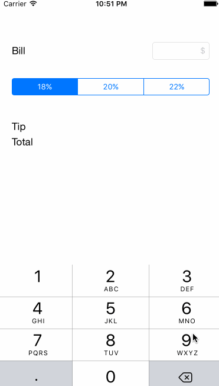

# Pre-work - tips

tips is a tip calculator application for iOS.

Submitted by: Vishay Nihalani

Time spent: 1 hour spent in total, then 1 hour redoing it and fighting with Github for Desktop

## User Stories

The following **required** functionality is complete:
* [x] User can enter a bill amount, choose a tip percentage, and see the tip and total values.

The following **optional** features are implemented:
* [x] Custom font
* [ ] UI animations
* [x] Making sure the keyboard is always visible and the bill amount is always the first responder. This way the user doesn't have to tap anywhere to use this app. Just launch the app and start typing.

The following **additional** features are implemented:

- [ ] List anything else that you can get done to improve the app functionality!

## Video Walkthrough

Here's a walkthrough of implemented user stories:

GIF created with [LiceCap](http://www.cockos.com/licecap/).

## Notes

When I disabled Size Classes and built for iPhone 6S, the dimensions in Storyboard didn't match the dimensions in Simulator. The Simulator appeared to be about 10% wider than the Storyboard, leaving extra horizontal padding on the right side. I had to change the Simulated Metrics screen size to iPhone 4.7-inch screen. After doing this, the Connect Hardware Keyboard setting toggled silently in Simulator causing the text field to longer respond to the soft keyboard.

Also, I had some trouble with Github for Desktop. I made some changes that caused Xcode to prompt me to revert changes, and whatever action I took blew out my entire repo. I had to redo the project, which is why it's just the barebones version attached here :( .

## License

Copyright 2016 Vishay Nihalani

Licensed under the Apache License, Version 2.0 (the "License");
you may not use this file except in compliance with the License.
You may obtain a copy of the License at

http://www.apache.org/licenses/LICENSE-2.0

Unless required by applicable law or agreed to in writing, software
distributed under the License is distributed on an "AS IS" BASIS,
WITHOUT WARRANTIES OR CONDITIONS OF ANY KIND, either express or implied.
See the License for the specific language governing permissions and
limitations under the License.
